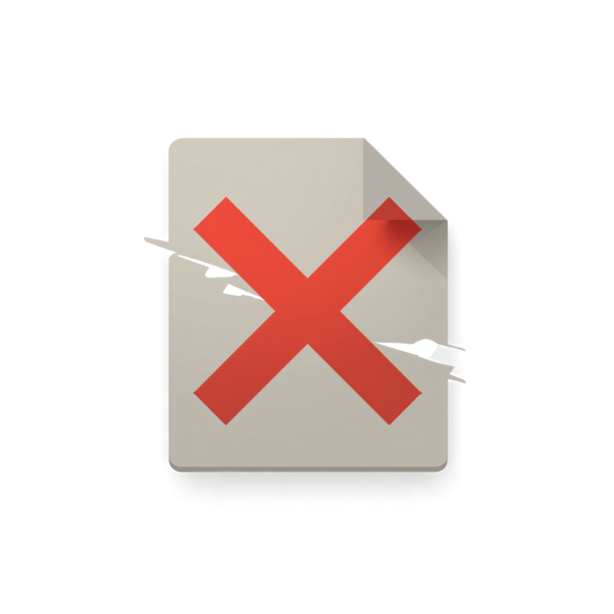

# ImgGone

<p align="center">
  
</p>

A simple GUI tool for finding and deleting corrupted image files on Linux/KDE.

  

## What it does

Scans a folder for image files and tries to decode each one. Any image that fails to open — corrupted, empty, or a broken symlink — gets listed so you can delete it.

**Detected error types:**
- `Corrupted image: failed to decode` — file exists but can't be read as an image
- `Empty file (0 bytes)` — zero-byte image file
- `Broken symlink` — image link pointing to a missing file
- `Permission denied` / `I/O Error` — OS-level read failures

**Supported formats:** PNG, JPG/JPEG, GIF, BMP, WebP, TIFF, ICO, PBM, PGM, PPM

## Install

**Requirements:** Python 3.10+ and PyQt6

Install PyQt6 first if you don't have it:

| Distro | Command |
|---|---|
| Arch / CachyOS / Manjaro | `sudo pacman -S python-pyqt6` |
| Debian / Ubuntu | `sudo apt install python3-pyqt6` |
| Fedora | `sudo dnf install python3-pyqt6` |

Then install ImgGone with one command:

```bash
curl -fsSL https://raw.githubusercontent.com/JovanEhren/ImgGone/main/scripts/install.sh | bash
```

This downloads the app, adds it to your app menu, and creates an `imggone` command.

## Usage

Launch from the app menu or run:

```bash
imggone
```

1. Click **Browse…** and select a folder
2. Check **Include subfolders** to scan recursively
3. Click **Scan**
4. Select the corrupted images in the list
5. Click **Delete Selected** and confirm

## Uninstall

```bash
curl -fsSL https://raw.githubusercontent.com/JovanEhren/ImgGone/main/scripts/uninstall.sh | bash
```

## Run from source

```bash
git clone https://github.com/JovanEhren/ImgGone.git
cd ImgGone
python3 main.py
```